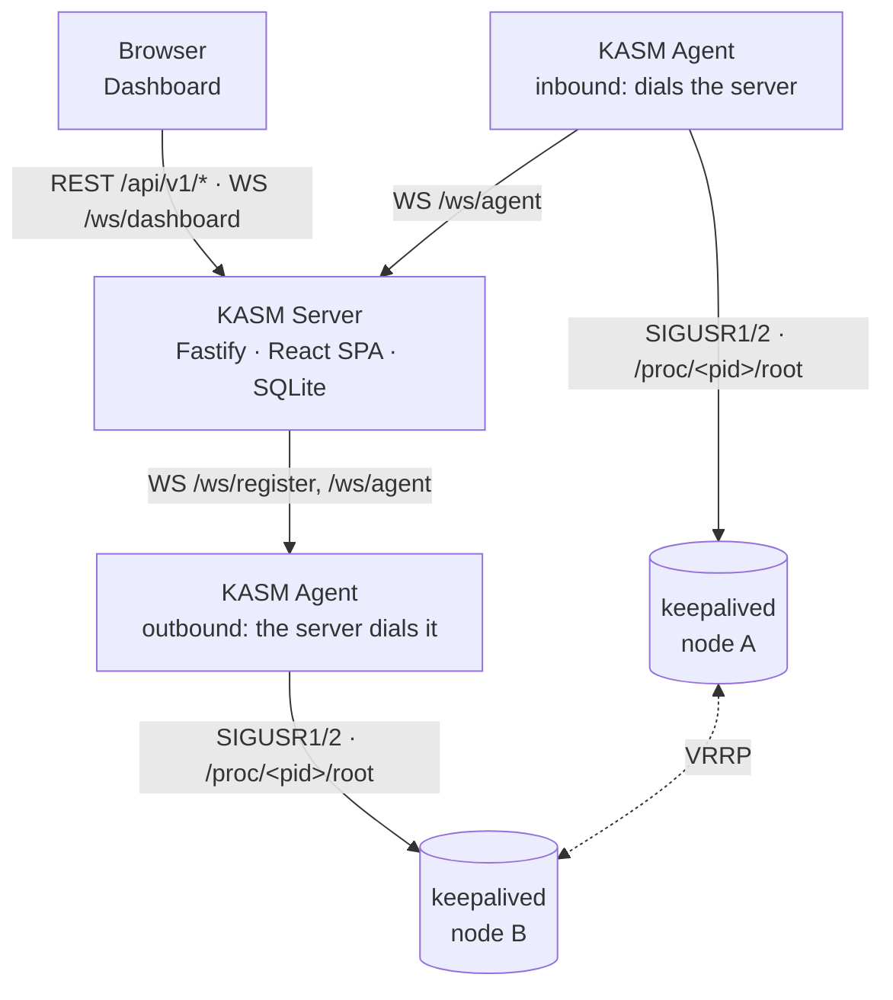

# Keepalived Status Monitor (KASM)

A keepalived pair is easy to look after while it works: one node holds the virtual address,
the other waits. The questions start when it does not — which node is MASTER right now, did
the address move last night and why, is there a pair where *both* nodes think they are
MASTER? keepalived answers them only on the host itself, in its log and in a state dump it
writes on a signal.

**Keepalived Status Monitor (KASM) gives those hosts one dashboard.** A lightweight Node.js
agent runs next to keepalived on each host; a central Fastify/React server collects what the
agents read and shows every VRRP instance, grouped into the clusters they form. KASM changes
nothing in keepalived — it watches.

## How the pieces fit together

Three parties are involved:

| | What it holds | Talks to |
|---|---|---|
| **KASM server** | The client list, users, registration tokens, settings, the last keepalived reading of every host and the activity list — in SQLite | the browser, the agents |
| **KASM agent** | Its identity, its last reading and the activity events not yet acknowledged — in its own data directory | the KASM server, the local keepalived |
| **keepalived** | The VRRP instances, sync groups and their counters | the agent, through signals and its dump files |



The WebSocket between server and agent is one persistent connection, and it does not
matter which side opened it. An **inbound** agent dials the server — the usual case when the
host can reach the server. An **outbound** agent listens on a port of its own and the server
dials it — for hosts the server can reach but that cannot reach the server. Either way the
same messages flow over it; see [Connection Modes](client.md#-connection-modes).

## How the agent reads keepalived

keepalived has no status API. It writes its state to a file when it receives a signal, and
that is what the agent uses, every five seconds by default:

1. It finds keepalived's parent process in `/proc` — the agent shares the host's PID
   namespace for that.
2. It sends `SIGUSR1` (state dump) and `SIGUSR2` (counters) and waits until keepalived has
   rewritten `/tmp/keepalived.data` and `/tmp/keepalived.stats`.
3. It reads both through `/proc/<pid>/root/tmp/…`, keepalived's own view of the file system —
   so a systemd `PrivateTmp=true` changes nothing.
4. It takes over the fields it names — state, priorities, interface, VRID, virtual addresses,
   last transition, counters — and nothing else. `auth_pass` never leaves the host.
5. It compares the reading with the previous one and reports every change as an activity
   event, with the time keepalived gives for the transition.

Details, the permissions this needs and the JSON dump alternative are in
[Client Agent](client.md).

## Clusters and their health

The server — and the dashboard, with the same function from `shared` — groups the instances
of all hosts into **clusters**: instances with the same VRID and the same virtual addresses
answer for the same virtual router. A VRID alone is only unique per network segment, which is
why the addresses are part of the key.

| Health | Means |
|---|---|
| **Healthy** | Exactly one online member is MASTER, every member reports. |
| **Degraded** | One MASTER holds, but a member is in FAULT, its agent is offline, or it is the only member. |
| **No MASTER** | No online member is MASTER — the virtual addresses are not being served. |
| **Split brain** | More than one member claims MASTER for the same virtual router. |
| **Unknown** | No member's agent is online. |

The dashboard lists the clusters that need attention; the **VRRP Clusters** page shows all of
them.

## What it does

- **VRRP at a glance** — every instance on every host with its state, configured and
  effective priority, interface, VRID, virtual addresses and last transition.
- **Cluster view** — instances grouped by virtual router and checked for split brain,
  missing MASTER and degraded members.
- **Failover history** — every state change as an activity event with keepalived's own
  timestamp; MASTER stepping down is a warning, FAULT an error.
- **Counters** — keepalived's per-instance statistics.
- **Nothing sensitive leaves the host** — only named fields are read; no Docker socket, no
  host file system mount.
- **Secure communication** — agents register with a short-lived token and a setup PIN, then
  authenticate with a permanent token; each client is bound to an allowed address.
- **Authentication** — local accounts and OIDC single sign-on.

<div class="grid cards" markdown>

-   :material-rocket-launch: **Install it**

    ---

    Docker Compose for the server and for each agent, the configuration files, and the
    permissions the agent needs.

    [:octicons-arrow-right-24: Installation & Setup](install.md)

-   :material-sitemap: **Understand it**

    ---

    How the control plane, the dashboard and the agent fit together.

    [:octicons-arrow-right-24: Backend](backend.md) ·
    [:octicons-arrow-right-24: Frontend](frontend.md) ·
    [:octicons-arrow-right-24: Client Agent](client.md)

-   :material-api: **Integrate with it**

    ---

    Every REST endpoint and both WebSocket protocols, request and response shapes
    included.

    [:octicons-arrow-right-24: API Reference](api.md)

-   :material-source-branch: **Contribute to it**

    ---

    Local environment with two keepalived nodes, the Conventional Commits the release is
    derived from, and the build pipeline.

    [:octicons-arrow-right-24: Development Guide](development.md)

</div>

## The repository

The diagram above is the deployment view. In the source tree, KASM is an npm monorepo with
four workspaces:

| Workspace | What it is |
|---|---|
| [`server/backend`](backend.md) | Fastify API server — the control plane and the WebSocket hub, holding the SQLite database. |
| [`server/frontend`](frontend.md) | React SPA (Vite, Tailwind, Zustand), served by the backend from `server/dist/public`. |
| [`client`](client.md) | Lightweight Node.js daemon next to keepalived. It reads keepalived's state, reports it and every change to it. |
| `shared` | Single source of truth for the TypeScript types, Zod schemas, constants and the cluster grouping the other three agree on. |

## Getting started in one minute

```bash
# Server
docker run -d --name kasm-server -p 3010:3010 \
    -v ./server-data:/app/server/backend/data \
    -v ./server-config.yaml:/app/server/config.yaml \
    ghcr.io/stefgo/kasm-server:latest
```

Then open <http://localhost:3010> and log in with `admin` / `admin` — and change that
password right away. **Add Client** in the dashboard walks you through connecting the first
host. The full Compose files for server and agent are in
[Installation & Setup](install.md).
