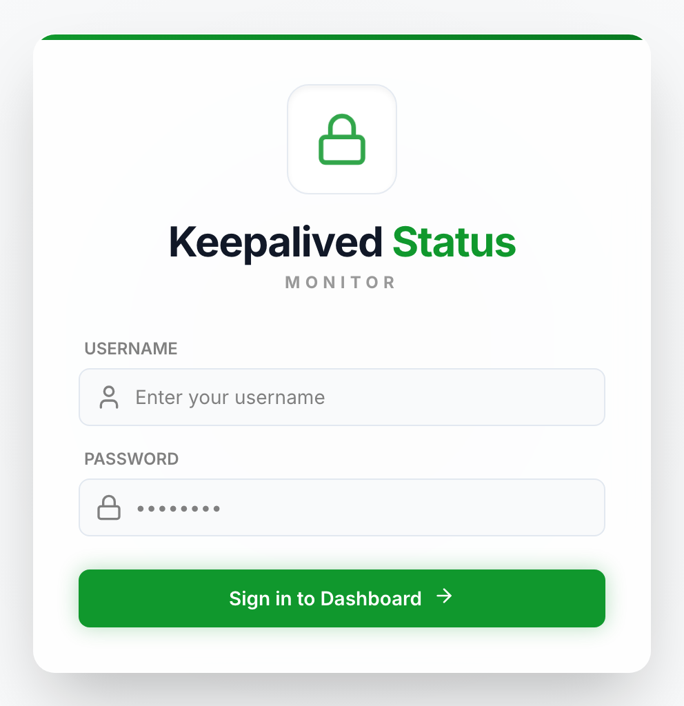
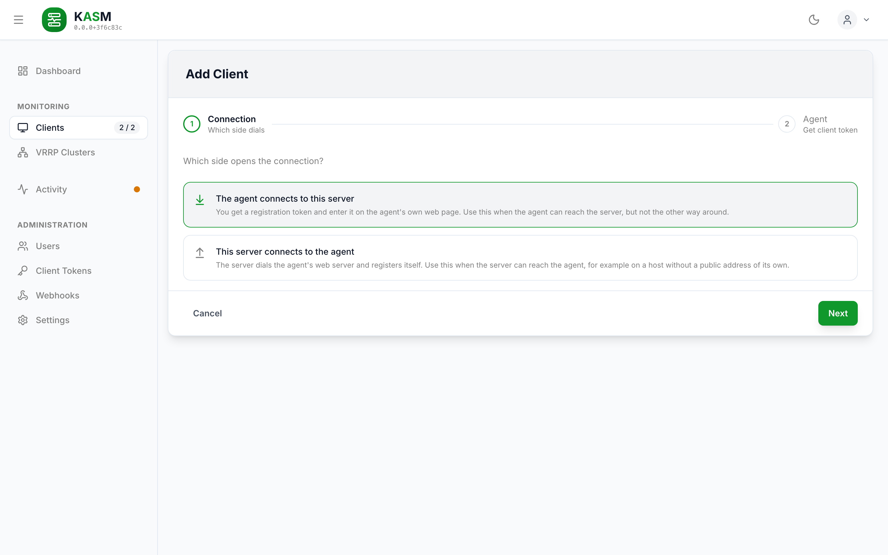

# Quick Start

From nothing to a first monitored keepalived host in four steps: start the server, sign in,
start an agent next to keepalived, register it. It needs nothing but Docker.

You need:

- **Docker** with the Compose plugin on the machine that runs the server and on every
  keepalived host (`linux/amd64` or `linux/arm64`, a Raspberry Pi works).
- **keepalived** on the hosts to be monitored — any 2.x release. The agent reads it through
  its state dump; nothing has to be enabled in keepalived for that.
- **A network path from each agent to the server** on port 3010. If only the server can reach
  the host, not the other way round, see
  [Outbound registration](client.md#outbound-registration).

To run KASM from a checkout instead, see [Development](development.md).

## 1. Start the server

Create a directory with two files:

```bash
mkdir kasm-server && cd kasm-server
touch server-config.yaml
```

The empty `server-config.yaml` is on purpose: the server fills it on its first start and
stores its session secret there. **Create it before the first `up`.** Without the file Docker
mounts an empty *directory* in its place, and the server cannot save its secret — every
restart would then sign everybody out.

`compose.yaml`:

```yaml
services:
    kasm-server:
        image: ghcr.io/stefgo/kasm-server:latest
        container_name: kasm-server
        ports:
            - "3010:3010"
        volumes:
            - server-data:/app/server/backend/data       # SQLite database
            - ./server-config.yaml:/app/server/config.yaml
        environment:
            - NODE_ENV=production
        restart: unless-stopped

volumes:
    server-data:
```

```bash
docker compose up -d
docker compose ps          # after ~20 s: kasm-server … (healthy)
```

> **Put it behind a reverse proxy with TLS before it leaves your LAN**, and list the proxy in
> `security.trusted_proxies` — otherwise every request appears to come from the proxy. See
> [Security](security.md#reverse-proxy).

## 2. Sign in

Open `http://<server>:3010` and sign in with **`admin` / `admin`**.



*The sign-in form. With OIDC configured it offers single sign-on as well.*

**Change that password now**, in the user management or through
`PUT /api/v1/users/:userId`. The server creates this account only while the user table is
empty, and logs a warning when it does.

## 3. Start an agent on a keepalived host

On the host that runs keepalived, again a directory with two files:

```bash
mkdir kasm-client && cd kasm-client
sudo touch client-config.yaml
```

The file has to belong to root, hence `sudo`: the agent below runs without `DAC_OVERRIDE` and
can write only files root owns ([Security](security.md#hardening)). If your `keepalived.conf`
moves the dump files (`state_dump_file`, `stats_dump_file`), set the same paths under
`keepalived:` in it — see [Configuration](configuration.md#agent-configyaml).

`compose.yaml`:

```yaml
services:
    kasm-client:
        image: ghcr.io/stefgo/kasm-client:latest
        container_name: kasm-client
        network_mode: host
        pid: host
        cap_drop:
            - ALL
        cap_add:
            - KILL          # signal keepalived to write its state
            - SYS_PTRACE    # read that state through /proc/<pid>/root
        security_opt:
            - apparmor:unconfined
            - no-new-privileges:true
        read_only: true
        tmpfs:
            - /tmp
        volumes:
            - ./client-config.yaml:/app/client/config.yaml
            - client-data:/app/client/data               # identity, last reading, queue
        environment:
            - NODE_ENV=production
        restart: unless-stopped

volumes:
    client-data:
```

The agent shares the host's PID namespace to find keepalived and reads its state through
`/proc/<pid>/root`. **That makes it root on the host in all but name** — read
[Agent Permissions](security.md#agent-permissions) before you deploy it.

```bash
docker compose up -d
docker logs kasm-client
```

The log shows a box with the **setup PIN**. You need it in a moment:

```
──────────────────────────────────────────────
  Setup PIN:  K7QM-3XRD
  Web UI:     http://<this-host>:3011/register
  …
──────────────────────────────────────────────
```

> **`client-data` has to be a named volume.** It holds the identity the server issues at
> registration. Lose it and the agent has to be registered again.

## 4. Register the agent

In the dashboard, **Clients → Add Client** → *The agent connects to this server*.



The wizard takes an optional display name and an allowed IP or network for the new client;
leave both empty to use the agent's hostname and the address it registers from. It then
shows the registration token — copy it.

Then open the agent's page at `http://<host>:3011/register` and enter:

| Field | Value |
| :---- | :---- |
| Server URL | `http://<server>:3010` (or the URL of your reverse proxy) |
| Registration token | the token from the wizard |
| Setup PIN | the PIN from `docker logs kasm-client` |

**Register** — the agent stores its identity, connects, and the register page closes itself.
Back in the dashboard the host is listed under **Clients**, and its VRRP instances show up
with the first reading, grouped into clusters with the other hosts that share them.

## What next

- **More hosts:** repeat steps 3 and 4 on each keepalived host. A cluster is complete once
  every one of its members reports.
- **See a failover at once** instead of at the next 5-second poll:
  [Faster Failover Detection](configuration.md#faster-failover-detection).
- **Be told about it:** [Webhooks](webhooks.md).
- **Settings you may want now:** OIDC sign-in, retention — [Configuration](configuration.md).
- **Before going to production:** [Security](security.md) and
  [Operations](operations.md) (backups, upgrades, health checks).
